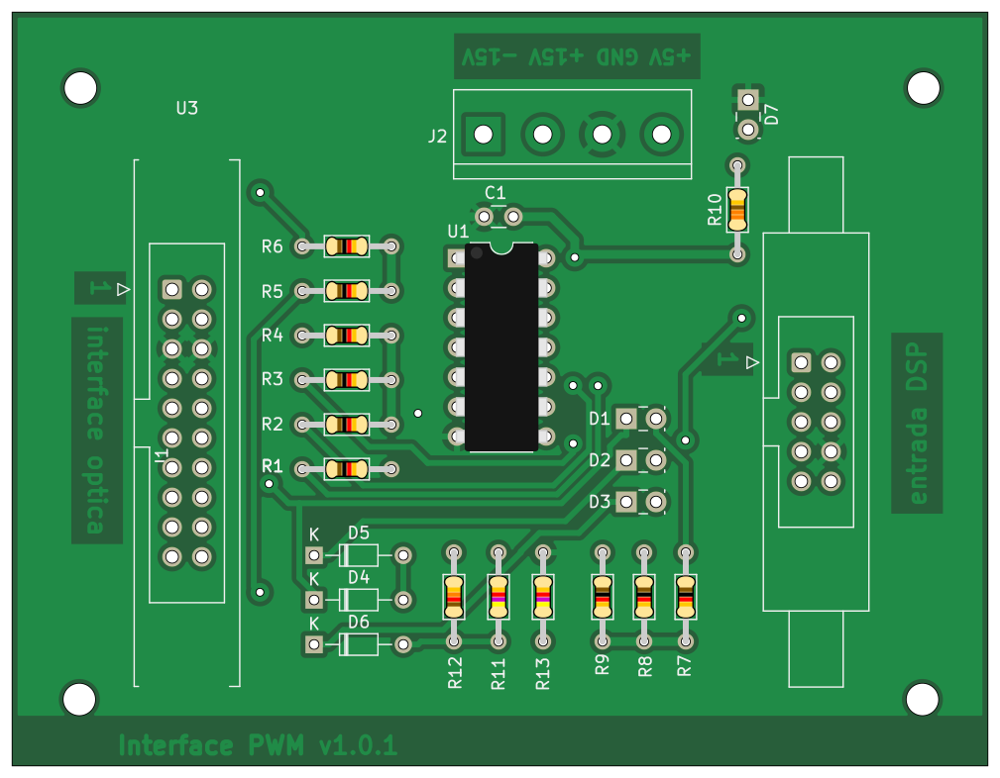
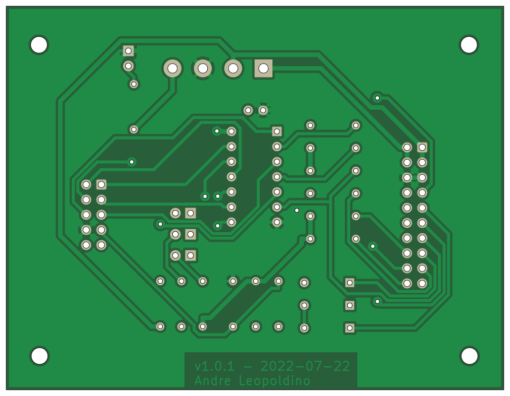

# Running PcbDraw using bat file
Simple batch script to run [PcbDraw](https://github.com/yaqwsx/PcbDraw) on Windows environment to draw KiCAD pcbs.
The example creates plot for both sides of the pcb.

<p float="left">
  
   
</p>

For more information about PcbDraw please check the [oficial repository](https://github.com/yaqwsx/PcbDraw).

## Dependencies

With KiCAD terminal activated, `kicad-cmd`, install the PcbDraw package using:

```pyhton
pip install pcbdraw
```


## Using it

- Update the [`make-plot-board.bat`](./make-plot-board.bat) file with the appropriate configs (line 11-16)
```cmd
REM config variables
SET ROOT_FILENAME=pwm-interface-board
SET FILE_PATH=./example/
SET CONFIG=--drill-holes --style jlcpcb-green-hasl
REM could be .svg, .png or .jpeg
SET OUTPUT_EXTENSION=.png
```

- Just give a double click on `make-plot-board.bat` or run it from terminal.


_Tested with KiCAD v6.0.10._